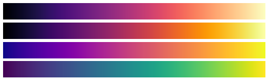

# Elm Colormaps

`elm-colormaps` is a collection of high-quality colormaps that are intended for data visualization and scientific plotting.

For now it mainly provides a port of the four fantastic colormaps (`magma`, `inferno`, `plasma`, and `viridis`) that are included in matplotlib since version 1.5. They are perceptually uniform, colorblind friendly and can be printed out in grayscale with minimal loss of information.



This library provides these colormaps as functions of type `Float -> Color`, where the floating point number should lie between 0 and 1.

Interoperability with the `elm-css` Color type can be achieved easily as shown in the Css example in the xxx and the examples directory contains code for anything from ui elements to svg.

There are helper functions that let you define your own colormaps, and more colormaps will be included in the future.

## interop with elm-css

Since Elm-Css currently has a different Color Type than the Base library, colors have to be converted if used for the former. This library does't provide that out of the box, in order to avoid a dependency that is not necessary for every user. Conversion can be achieven with the following function:

```elm
colorCoreToCss : Color.Color -> Css.Color
colorCoreToCss c =
    let
        { red, green, blue, alpha } =
            Color.toRgb c
    in
        Css.rgba red green blue alpha
```

## todo, examples directory:

-- short tutorial


## What are Colormaps

A colormap represents an interval of real numbers as a gradient of colors so that plots can intuitively communicate the magnitudes of a dense set of data.

--x map example

These mappings to a colorspace should ideally preserve the linear relationship between those numbers, such that large numbers are clearly distinguishable from smaller ones independant of the context. The canonical bad example for this is rainbow colormaps that try to use the largest spectrum of available colors, but fail to give a good sense of distance between two numbers.

## sources:

https://bids.github.io/colormap/

https://matplotlib.org/examples/color/colormaps_reference.html

https://matplotlib.org/tutorials/colors/colormaps.html
